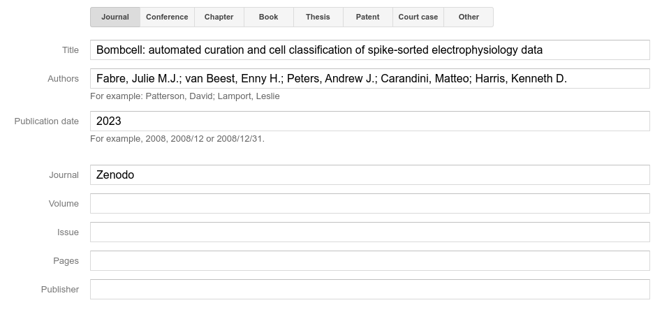

To add your code on zenodo to your google scholar profile (and get citations show up):

- Your code on zenodo needs to be cited in a format like this:

> Julie M.J. Fabre, Enny H. van Beest, Andrew J. Peters, Matteo Carandini, & Kenneth D. Harris. (2023). Bombcell: automated curation and cell classification of spike-sorted electrophysiology data. Zenodo. https://doi.org/10.5281/zenodo.8172821

- You need to add it to google scholar like this: 
